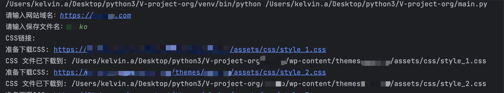
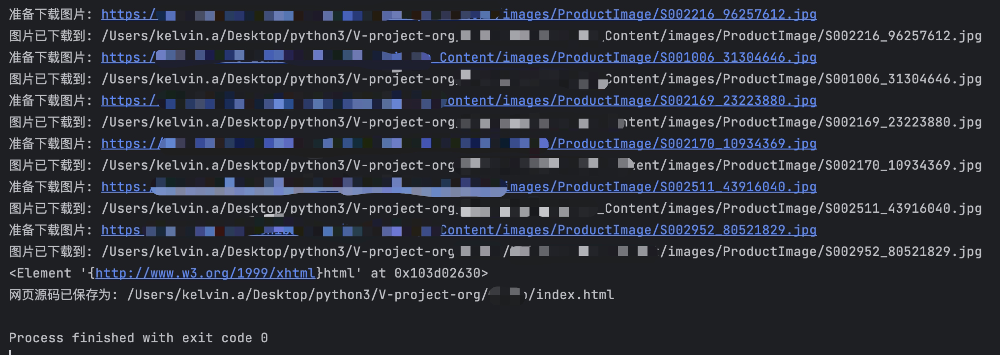

# v-porject
用于测试网页的静态资源库，批量下载测试网站的样式文件、js文件以及图片

## 运行方式：

1. 安装好python3的环境

2. 运行：`python -r requirements.txt`

3. 运行后，界面输入应对的域名，不要忘记 http:// 或者 https://

4. 运行后，界面输入要存储的文件夹的名称

5. 运行截图

   

   
